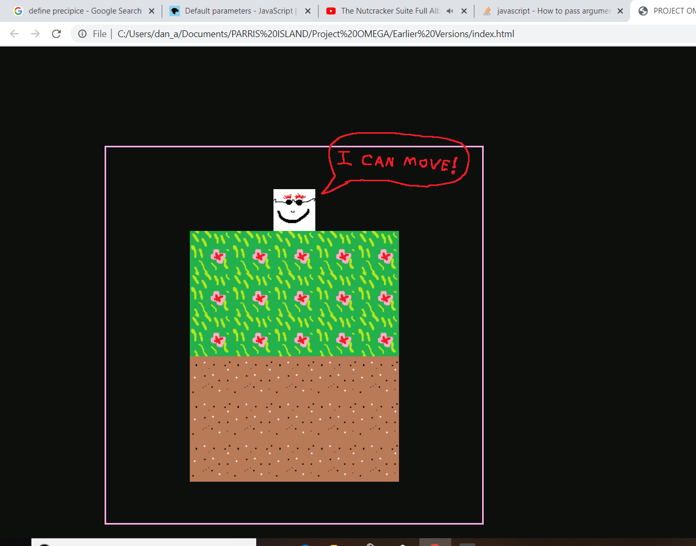
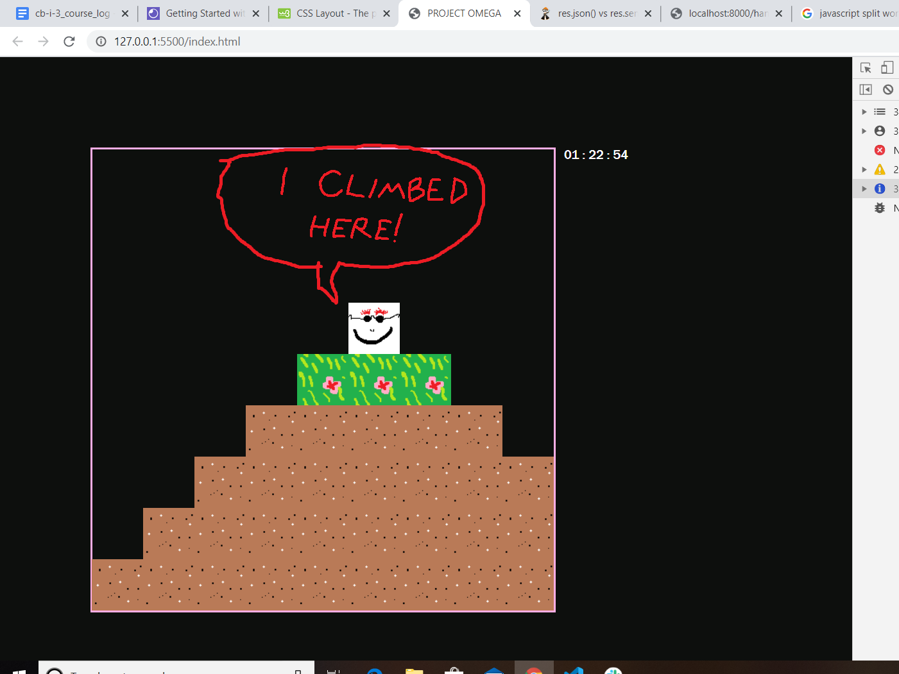

## In the Beginning there was nothing...

---

---

## Then there was the world!

---

---

## PHASE ONE: Creating the World

In the initial setup phase, I want to be able to run a function that will populate an onscreen grid with tiles, then have a player character tile that can be moved around using the arrow keys.

## Then came the lengthy list of to-do items, uncommented when they're completed:

---

## Incremental Change Log:

1. Render one block, at the middle of the screen.

2. Render 4 more blocks in a row at the top of the screen.

3. Create block object class, in a separate file. And move all .js files to scripts folder.

4. Test block object class by making a block with it.

5. Update block maker function so that it is limited by the world's x-dimension when adding new blocks to a row.

6. Add dimensions to the world as global variables.

7. I really want the world to be a ball at the middle, rather than a line at the top. Let's change the original block-maker function, so it can be assigned start and stop coordinates that are 'out in the world' instead of being stuck at the top...
Success! It even remembered where the world ended and dropped to the next row at the appropriate spot!
---

---

8. Now I think we've just about perfected the basic block maker function. Time to upgrade it to the Block Printer, which will take parameters which define a shape, and call the block maker function to make this shape. We'll start with... a rectangle!

9. At Lauren's request, also added block classes somewhat ahead of schedule. A little bit clunky now with the block functions as they are, so it's high time to consolidate the block maker function into one module.

10. Create a Player Class: Start by just rendering the player to the world in a given location.

11. Add player method to enable movement when called by game engine button handling function.

12. Add button handling function in game engine that calls player movement method.

13. Add button listener and test it out!

14. Save the Project in version 0.1 file to safeguard all this progress against future tampering!

---

## PHASE TWO: The Laws of Motion

In phase two time will be introduced, in order to regulate motion. The CSS grid setup that was initially used to render the blocks on the screen will be abandoned in favour of a 'pseudo-grid' like the cats game had. Blocks don't move so their positions can be given in grid-like intervals so their render function won't change much, but the player avatar will be able to move about the world smoothly, with position changing according to inputs from the arrow keys. The ultimate goal of this phase will be to allow the player to move and jump around on top of the terrain and be restricted by the presence of blocks - you can jump over a single block but a wall of 2 or more blocks in height is an impassable obstacle. For the moment, the player's avatar will always come to rest in an exact 'pseudogrid' position, but the movement between spaces will be smooth and can be controlled by the transition speed setting in CSS.

## Incremental Goals:

1. Time to add a timer! We'll just borrow the real time for now and keep track of it off to the side somewhere...

2. Speaking of off to the side, let's add a sidebar along the right side of the page to keep track of stuff like the time (and a lot of other things eventually if we're lucky).

3. Get off the grid! Replace the current grid display with a more fluid frame of reference that MIMICS the grid in terms of simple block deployment, but leaves open the possibility of the player moving around in a more fluid manner. Start by remaking the blocks' render function and corresponding constructor attributes to comply with the new way, brother.

4. Using the block locations array to keep track of where the player can and can't go: in the game engine, have the player's movement handler function query the blocks array to establish whether the user is next to a block in the direction they're asking to move. The pseudo-grid rules governing the player's movement should make this fairly easy.

5. To save on memory, or get some kind of gravity boost, re-arrange blocks array into an object containing an attribute representing each column, in the form on an array: e.g. {Col A: [1,2,3], Col B: [2,3,4], ... } Thus each column can have a name which is the x-value, and each block within only needs to provide its y coordinate as proof that a particular 'cell' is occupied.

6. Gravity. Make it so that, if the column you're in doesn't contain a block in the cell below you, you move into that cell. This might involve a game time loop...
... It works! You can even jump up if it's just one tile, although it's a little bit clunky.

---

## PHASE THREE:

# More World: Make it possible to store more terrain that is outside the main world screen.
# Terrain should be kept in memory but not rendered unless it's within the screen.
# Screen 'moves' to follow the player character.

## PHASE FOUR: Picking Things Up! 
# There are items, and you can pick them up.
# Having items has an effect.
# You can alter terrain with an item.