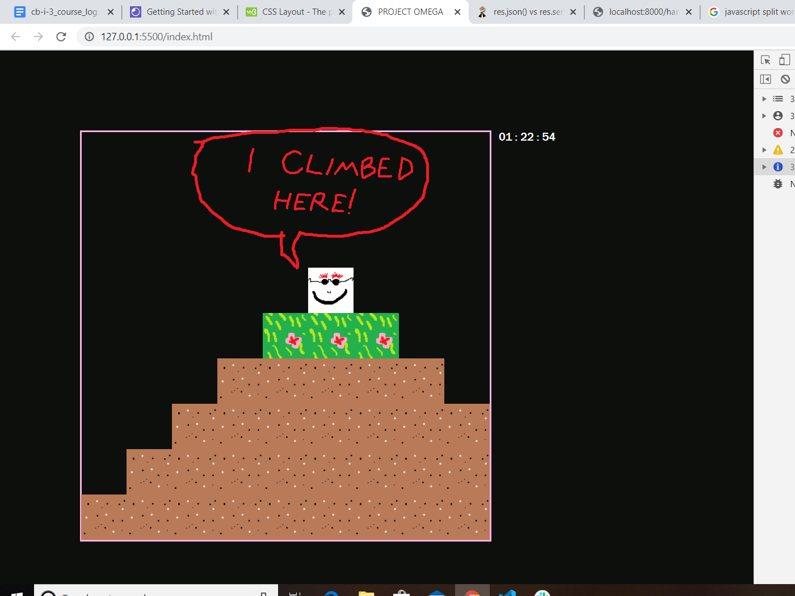
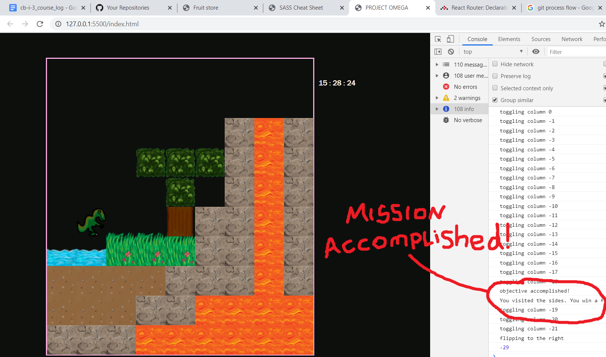

# In the Beginning there was nothing...

---

---

## Then there was the world!

---

---

# PHASE ONE: Creating the World

In the initial setup phase, I want to be able to run a function that will populate an onscreen grid with tiles, then have a player character tile that can be moved around using the arrow keys.

## Then came the lengthy list of to-do items, uncommented when they're completed:

## Incremental Change Log:

1. Render one block, at the middle of the screen.

2. Render 4 more blocks in a row at the top of the screen.

3. Create block object class, in a separate file. And move all .js files to scripts folder.

4. Test block object class by making a block with it.

5. Update block maker function so that it is limited by the world's x-dimension when adding new blocks to a row.

6. Add dimensions to the world as global variables.

7. I really want the world to be a square at the middle, rather than a line at the top. Let's change the original block-maker function, so it can be assigned start and stop coordinates that are 'out in the world' instead of being stuck at the top...
Success! It even remembered where the world ended and dropped to the next row at the appropriate spot!
---

---

8. Now I think we've just about perfected the basic block maker function. Time to upgrade it to the Block Printer, which will take parameters which define a shape, and call the block maker function to make this shape. We'll start with... a rectangle!

9. At Lauren's request, also added block classes somewhat ahead of schedule. A little bit clunky now with the block functions as they are, so it's high time to consolidate the block maker function into one module.

10. Create a Player Class: Start by just rendering the player to the world in a given location.

11. Add player method to enable movement when called by game engine button handling function.

12. Add button handling function in game engine that calls player movement method.

13. Add button listener and test it out!

14. Save the Project in version 0.1 file to safeguard all this progress against future tampering!

---

---

# PHASE TWO: The Laws of Motion

In phase two time will be introduced, in order to regulate motion. The CSS grid setup that was initially used to render the blocks on the screen will be abandoned in favour of a 'pseudo-grid' like the cats game had. Blocks don't move so their positions can be given in grid-like intervals so their render function won't change much, but the player avatar will be able to move about the world smoothly, with position changing according to inputs from the arrow keys. The ultimate goal of this phase will be to allow the player to move and jump around on top of the terrain and be restricted by the presence of blocks - you can jump over a single block but a wall of 2 or more blocks in height is an impassable obstacle. For the moment, the player's avatar will always come to rest in an exact 'pseudogrid' position, but the movement between spaces will be smooth and can be controlled by the transition speed setting in CSS.

## Incremental Goals:

1. Time to add a timer! We'll just borrow the real time for now and keep track of it off to the side somewhere...

2. Speaking of off to the side, let's add a sidebar along the right side of the page to keep track of stuff like the time (and a lot of other things eventually if we're lucky).

3. Get off the grid! Replace the current grid display with a more fluid frame of reference that MIMICS the grid in terms of simple block deployment, but leaves open the possibility of the player moving around in a more fluid manner. Start by remaking the blocks' render function and corresponding constructor attributes to comply with the new way, brother.

4. Using the block locations array to keep track of where the player can and can't go: in the game engine, have the player's movement handler function query the blocks array to establish whether the user is next to a block in the direction they're asking to move. The pseudo-grid rules governing the player's movement should make this fairly easy.

5. To save on memory, or get some kind of gravity boost, re-arrange blocks array into an object containing an attribute representing each column, in the form on an array: e.g. {Col A: [1,2,3], Col B: [2,3,4], ... } Thus each column can have a name which is the x-value, and each block within only needs to provide its y coordinate as proof that a particular 'cell' is occupied.

6. Gravity. Make it so that, if the column you're in doesn't contain a block in the cell below you, you move into that cell. This might involve a game time loop...
... It works! You can even jump up if it's just one tile, although it's a little bit clunky.

---

---

# PHASE THREE: The End of the Beginning

In Phase Three I focused on tidying up the rules that govern (basic) movement, and also expanding the world beyond the borders of the display screen. This involved creating a new Columns object class to keep track of the individual blocks more easily, and to control the rendering/derendering of blocks as the player moves away from them, allowing the screen to follow the player as they traverse the world. Except for the starting screen, blocks are actually only generated when the player approaches them, and are then kept in the Column object's memory if the player leaves and then returns to them.

In this phase I also reorganized the game's file locations, made the game engine into its own object class, and added an intro/press any key (where's the any key??) screen so that the player can choose when to start. Minor improvements to the game's artwork were also incorporated in this stage. After this phase is complete it will be a matter of deciding what aspects to add next. The Top 3 condending options at this point are: Adding baddies, fighting, and the concept of death; improving and experimenting with the game's "physics", or introducing inventories/basic world manipulation. To add spice, these concepts will be developed in tandem with the game's level structure, with each successive feature having a 'level' built around it as a tutorial/to showcase the new feature.

## Incremental Goals:

1. Create Engine object class and rearrange the game's code to use it.

2. Have game wait on player action to start.

3. Make intro text object that loads before the game is visible and goes away when the any key is pressed.

4. Added new artwork with the help of Atack Artwork & Design Studios, who have their own graphics tablet:

---

---

5. If the player moves to within a certain distance of the edge in either direction, several things must happen simultaneously:
A: All blocks in the farthest distant column are de-rendered;
B: Everything in the world shifts away from the direction the player moved in:
  * There is a horizontal offset value in the game engine
  * All blocks' rendering calculations include the horizontal offset, and blocks have a method to toggle their dom elements
  * The player's dom element is also offset horizontally, so your sprite is shifted away from the edge as the screen 'follows' you.
* C: A new column is generated in front of the player, OR if the player is revisiting territory they moved away from, that column is re-rendered using the above-mentioned block dom toggle method.
* D: Introduced new Columns object class to store blocks and make de/rendering them easier.
* E: Columns object is called into existence as an attribute of the game engine.

6. Physics tweaks: You can't use the move right or move left methods more than once per game cycle and jumping makes you move up by 2 now instead of 1 since the game cycle is much faster. Better physics are on the to-do list for the near future.

7. Reassign world width global variable name to the width of the wider world, and reassign all values currently associated with that variable to 'screen width' since the world and the screen are no longer the same width.

8. Make the Columns object and the Engine (if applicable) use the new global world width variable in determining how many columns to generate.

9. Re-impose movement limitations on the player's movement and/or the screen scroll method so that both stop when you get to the edge of the wider world.

10. Crudely make some kind of level out of all this and make a mission for the player to touch both of the edges of the world. A console log message of congratulations is then proudly displayed!

---

---

11. Save this stage and get to work on some actual homework!

# PHASE FOUR: The Mission object and the World Builder Suite

In the first true stage beyond the game's initial setting up (phases one through three were essentially just one long march to the start line) I will introduce some pre-packaged environments for the player to run through, using more than just 2 of the 5 lovely tiles now at my disposal. There will be two types of things made here:
A) customized pre-built 'biomes' that span approximately a dozen or so tiles and that are completely pre-ordained (we'll store the column templates as lists of one-digit numbers and save a fortune on memory!) and
B) A 'smarter' Block printer that can remember what the previous column looked like and base the next one on that, so that even the non-pre-fabricated landscape is more interesting and also blends with itself a bit more smoothly.
Also featured in this stage will be a few more tile types in order to further expand the world's visual diversity, and in the anticipation of more interesting terrain properties to be introduced in the near future...
Lastly, since tidiness is the highest virtue, I will clean up the hastily added 'levels and objectives' stuff into something tidier and more attractive, and also try to expand the concept somehow, perhaps by adding some kind of little in-game 'Level Up' animation or a sidebar with messages... We'll see!

1. Create 'Biomes' library, and make one array of arrays which will serve as the blueprints for our first 'biome': each array represents one grid, and the numbers refer to different block types.

2. Alter Block Printer function to no longer take height argument; instead it will take an array of 'layers;' a list of block types to be placed, from the bottom up, to render the column.

3. NOTE TO SELF: Always build new functions that are replacing a previous function BESIDE their obsolete ancestors - not INSIDE them while they're still ostensibly 'live.' Transitions are much less alarming this way. Or at least, somewhat less alarming.

4. Finally make it so that you face the direction of your movement. Edit: Wow! Good old CSS... never thought I'd say that!

5. Make 3 new block types.

6. Draw, and then implement 3 more hand-crafted biomes.

---

---

7. Make it so that, as the screen scrolls, the block column object's block printer method builds a biome instead of a lone column when it is called.

8. Tidy up all of the level-making stuff into something cleaner and then remove all the console log signs except the one congratulating you for visiting the east/wester 'poles'. Also, add one for each separate pole so you can see your progress!

9. Make objective objects and mission objects, then use them to replace the mission objectives/level up features previously attained.

10. Standardize the start/end heights of the biomes, then make a randomizer feature in the biome printing method so it doesn't repeat the same terrain endlessly. Also make one more biome for variety.

11. Save current progress as version 0.1. We're restarting our version counts here, and the reason why is... to Create a repo on Github and learn the ropes of that system!!

---

---

# PHASE FIVE (AKA Version 0.2): Dynamic Blocks!

Phase Five will see the incorporation of three key features: blocks that have various properties such as permeability (water you can 'swim' in), climbability (think trees and later maybe ladders) and LETHALITY! This will lead us to finally develop the concept of the player's death, which in its initial stages will be immediate and thus will require the introduction of a 'restart' button in the game, and everything else that your death would require in terms of re-running/resetting things. The player's death will be hard to implement but not radically complicated since it's just a matter of finding what needs to be reset; the dynamic blocks interaction will require some more out-of-the-box thinking since we'll have to modify the columns' WayClear function to test the blocks for their attributes instead of simply seeing if there's something in the way of the intended direction of movement.

# Food for Future Thought: On Scalability for smaller screens: Screen Scroll distance variable might be worth its weight in gold.

# Artwork Upgrades: Polish up the edges of existing block types - looking at you, lava - so that they fit together more nicely. Display as tiles in the file where you work on them so you can see them side by side as you edit.